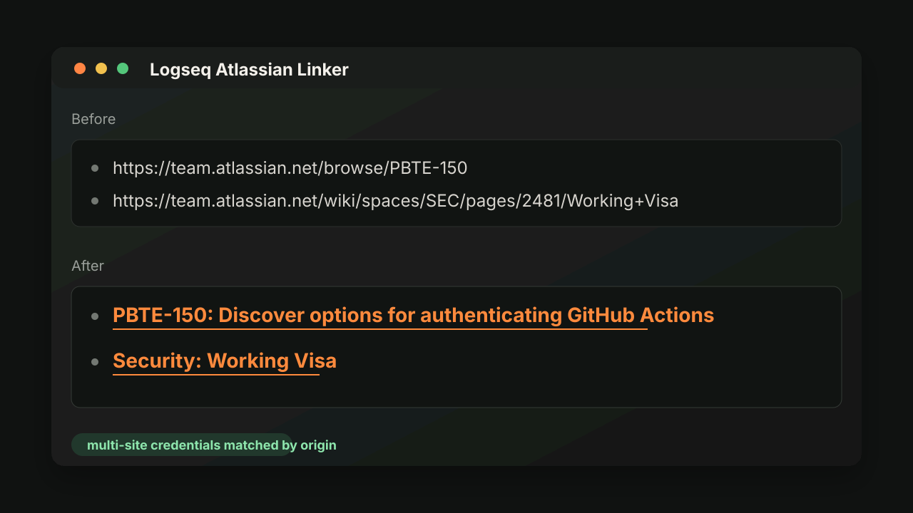

# Logseq Atlassian Linker

Logseq DB graph plugin that watches edited blocks for Atlassian Cloud links and rewrites them to standard Markdown links with Jira or Confluence titles.



## Development

This environment has conflicting Node CA settings. Use:

```sh
env -u NODE_USE_SYSTEM_CA npm install
env -u NODE_USE_SYSTEM_CA npm run build
```

Load the plugin root directory from Logseq Desktop with Developer mode enabled.

## Installation

Download `logseq-atlassian-linker.zip` from the latest GitHub release:

https://github.com/EINDEX/logseq-atlassian-db-plugin/releases

Unzip it, then load the extracted `logseq-atlassian-linker` directory from Logseq Desktop with Developer mode enabled.

For direct install metadata, use:

```edn
{:logseq-atlassian-linker
 {:version "vX.Y.Z"
  :repo "EINDEX/logseq-atlassian-db-plugin"
  :effect true
  :theme false}}
```

## Settings

Configure the plugin in Logseq settings with:

- Auto rewrite toggle
- Request timeout
- Optional legacy single-site fallback fields

Use the toolbar button or the `Manage Atlassian sites` command to configure multiple Atlassian sites. Each site stores:

- Site URL, for example `https://your-domain.atlassian.net`
- Atlassian account email
- Atlassian API token
- Enabled flag

The plugin matches links by exact site origin and only uses the credentials configured for that site. Links for unconfigured sites are left unchanged and show a warning.

API tokens are stored in Logseq plugin settings, so this plugin is intended for personal or internal use.

The plugin writes link titles only. It also removes legacy `atlassian-linker-*` block properties created by earlier local builds.

## Release

Update `CHANGELOG.md`, run the checks, then create a semver tag:

```sh
npm run check
npm run release:patch
git push origin main --follow-tags
```

Use `release:minor` or `release:major` when the change scope calls for it. Pushing a `v*` tag builds `dist/`, extracts the matching changelog section, and publishes a GitHub release zip.
